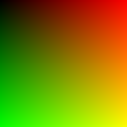

# Graphics Demo

<!-- PROJECT PREVIEW -->
## Preview
<p align="center">
  
</p>

<!-- GETTING STARTED -->
## Getting Started

### Prerequisites

Before attempting to build this project, make sure you have [GNU Make](https://www.gnu.org/software/make/), [CMake](https://cmake.org) and [ImageMagick](https://imagemagick.org/index.php) installed on your machine.

### Installation

To get a local copy of the project up and running on your machine, follow these simple steps:

1. Clone the project repository
   ```sh
   git clone https://github.com/Kaweees/graphics.git
   cd graphics
   ```
2. Build the project and generate a PPM file
   ```sh
   clear && cmake CMakeLists.txt && make && ./graphics > ./images/graphics.ppm
   ```
3. Convert the generated PPM file to a PNG file
   ```sh
   magick ./images/graphics.ppm ./images/graphics.png
   ```